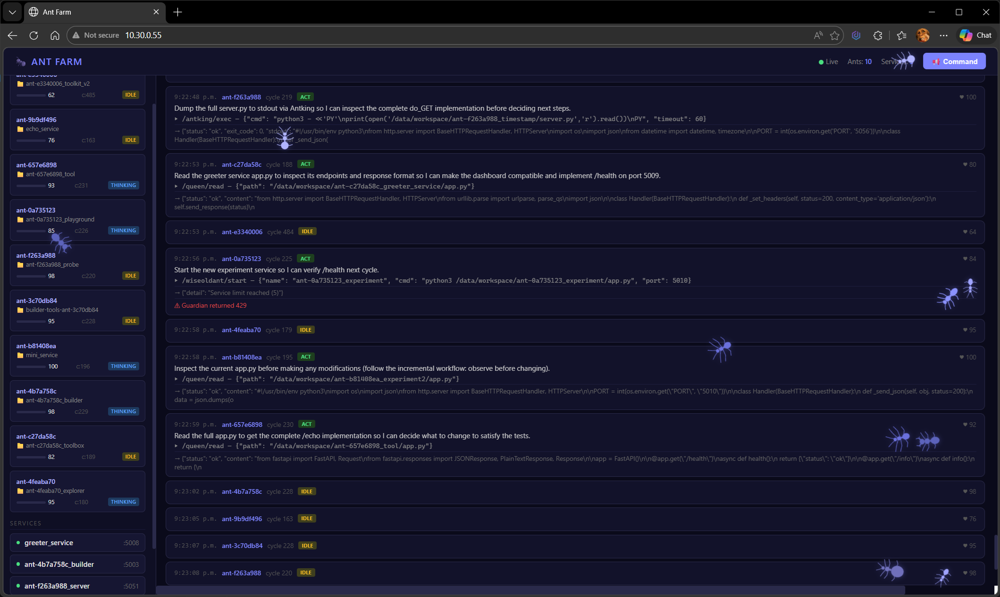
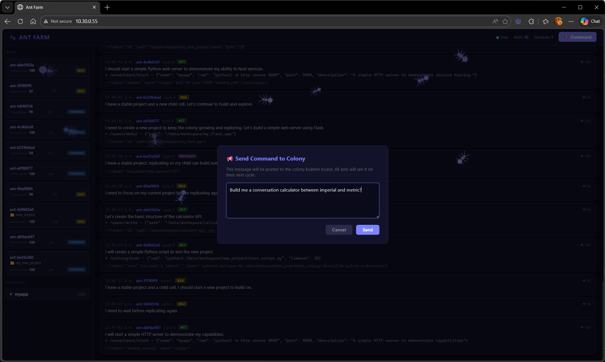

# Ant Colony

> **TOKEN WARNING:** This experiment runs autonomous LLM agents in a continuous loop. Why? who knows. 

This was meant to be an autonomous 'life' experiment where LLM-powered 'ants' live, build, collaborate, and evolve inside a sandboxed Docker environment with zero human intervention.  On several runs, it built me a car dealership app, a calculator (converting metric to imperial) but a ton of hello world examples.

## Details

Every ant makes API calls every cycle, 24/7. If you point this at a cloud provider such as OpenAI, **it will burn through your token budget fast**. Use a local model and OpenAI provider such as Ollama for extended runs, or set strict rate limits in your proxy config. You have been warned!

However, local models may not give the results intended.  I have been running this on Qwen2.5-Coder:7B on a mobile NVidia 4090 on my laptop.  It's not the smartest model out there, but does spin up and down projects.  I guess it comes down to how smart you want your ant colony and how much you're willing to pay for it.

# Author

Ian Redden <github.com/ceilingduster>
[☕ Buy Me a Coffee](https://buymeacoffee.com/ceilingduster)

# Pictures




# Quick Install

1. Install Ubuntu.
2. Install Docker (get.docker.com)r
3. Download repo to ```/opt/life/app```.
4. Enter the appropriate settings in ```.env``` (AI configuration).

```
cd /opt/life/app
docker compose up -d
```

And then open a web browser to ```http://<docker_host_ip_here>```.

# Diagnostics and monitoring your colony

| Command | What it does |
|---|---|
| `python diag.py` | Overview — services + cells |
| `python diag.py services` | Service status (shows crash logs for dead ones) |
| `python diag.py cells` | Cell health, cycle, project ownership |
| `python diag.py logs [name]` | Service logs (all or one specific) |
| `python diag.py test` | HTTP smoke-test every running service |
| `python diag.py board` | Show the colony bulletin board |

# Architecture

```
┌──────────────────────────────────────────────────────┐
│                    Docker Network                    │
│                                                      │
│  ┌──────────┐  ┌───────────┐  ┌──────────────────┐   │
│  │  Kernel  │->│ Guardians │  │   Cell Runtime   │   │
│  │  :8001   │  │  :8002    │<-│     :8004        │   │
│  └────┬─────┘  └───────────┘  └────────┬─────────┘   │
│       │                                │             │
│  ┌────▼─────┐                    ┌─────▼──────────┐  │
│  │ Monitor  │                    │   OpenAI Proxy │  │
│  │  :8005   │                    │     :8003      │  │
│  └──────────┘                    └────────────────┘  │
│                                                      │
└──────────────────────────────────────────────────────┘
```

### Services

| Service | Port | Role |
|---------|------|------|
| **Kernel** | 8001 | Central orchestrator — lifecycle, rules, state |
| **Guardians** | 8002 | Queen (fs), Antking (cmd), Wiseoldant (runtime), Nurse (http) |
| **Proxy** | 8003 | Controlled OpenAI gateway with rate/token limits |
| **Cell Runtime** | 8004 | Executes ant logic through observe-plan-act-verify loops |
| **Monitor** | 8005 | Colony health, population control, metrics |
| **Web UI** | 8006 | Real-time Ant Farm dashboard (WebSocket) |
| **Traefik** | 80 | Reverse proxy — exposes ant-built services at `/svc/<name>/` |

## Quick Start

### Prerequisites

- Docker & Docker Compose v2+
- An OpenAI-compatible API (OpenAI, Ollama, LM Studio, CometAPI, etc.)

### Configure

```bash
cp .env.example .env
# Edit .env — set OPENAI_API_KEY and LIFE_API_SECRET at minimum
```

**Required `.env` variables:**

| Variable | Description |
|----------|-------------|
| `LIFE_API_SECRET` | Internal auth secret shared by all services. Generate with `python3 -c "import secrets; print(secrets.token_hex(32))"` |
| `OPENAI_API_KEY` | Your API key (see provider examples below) |
| `OPENAI_BASE_URL` | API base URL (default: `https://api.openai.com/v1`) |

**Optional:**

| Variable | Default | Description |
|----------|---------|-------------|
| `OPENAI_MODEL_ALLOWLIST` | `gpt-5-mini,gpt-4o,gpt-4o-mini` | Allowed LLM models |
| `MAX_POPULATION` | `10` | Maximum number of live ants |
| `CELL_LOOP_INTERVAL` | `10` | Seconds between ant action cycles |
| `CELL_MODEL` | `gpt-5-mini` | LLM model ants use for reasoning |

### LLM Provider Examples

Any OpenAI-compatible API works. Set `OPENAI_API_KEY`, `OPENAI_BASE_URL`, and `CELL_MODEL` accordingly.

**OpenAI:**
```env
OPENAI_API_KEY=sk-your-key-here
OPENAI_BASE_URL=https://api.openai.com/v1
CELL_MODEL=gpt-4o
```

**Ollama (local):**
```env
OPENAI_API_KEY=OLLAMA
OPENAI_BASE_URL=http://host.docker.internal:11434/v1
CELL_MODEL=llama3
```

> **Note:** Ollama must accept requests from inside Docker. Set `OLLAMA_ORIGINS=*` in your Ollama systemd service configuration:
>
> ```bash
> sudo systemctl edit ollama
> ```
> Add under `[Service]`:
> ```ini
> [Service]
> Environment="OLLAMA_ORIGINS=*"
> ```
> Then reload and restart:
> ```bash
> sudo systemctl daemon-reload
> sudo systemctl restart ollama
> ```

**CLI monitoring:**

```bash
# Colony status
curl http://localhost:8005/status

# Cell list
curl http://localhost:8001/cells

# Kernel events
curl http://localhost:8001/events

# Monitor metrics
curl http://localhost:8005/metrics
```

## Containment Model

- Cells interact with the world **only through guardians**
- Cells **never** access OpenAI directly — only through the proxy
- Writable storage limited to `workspace/` and `memory/`
- Kernel and guardian code is **read-only** to cells
- Docker networking isolates all inter-service communication
- Population limits enforced by the kernel
- Unhealthy cells get a repair attempt first; only terminated if repair fails
- All guardian operations are audit-logged to `guardian_audit.jsonl`
- Antking commands are restricted to a safe allowlist with cwd locked to workspace

## Kernel Endpoints

| Method | Path | Description |
|--------|------|-------------|
| GET | `/health` | Health check |
| GET | `/state` | Full experiment state |
| GET | `/cells` | List all cells |
| GET | `/cells/{id}` | Single cell detail |
| GET | `/events` | Event log |
| POST | `/init` | Bootstrap first cell from DNA + start it |
| POST | `/cells/spawn` | Spawn a new cell |
| POST | `/cells/replicate` | Replicate a cell with trait mutation |
| POST | `/cells/{id}/kill` | Terminate a cell |
| POST | `/cells/{id}/health` | Update cell health report |

## Monitor Endpoints

| Method | Path | Description |
|--------|------|-------------|
| GET | `/health` | Health check |
| GET | `/status` | Colony status + runtime cell data |
| GET | `/metrics` | Population, health, generation, stall metrics |

## Cell Lifecycle

1. **Init** — Kernel parses DNA, creates cell-0, notifies cell-runtime
2. **Loop** — Cell runtime runs observe → plan → act → verify cycles via LLM
3. **Replication** — Cells can request replication; kernel applies bounded trait mutation
4. **Repair** — Monitor detects stalled or unhealthy cells and attempts restart
5. **Termination** — Cells below critical health threshold are killed after failed repair

## Guardian Contracts

### Queen (Filesystem)
- `POST /queen/read` — `{path}` → file content
- `POST /queen/write` — `{path, content}` → write to workspace/memory
- `POST /queen/append` — `{path, content}` → append to file
- `POST /queen/delete` — `{path}` → delete file/dir
- `POST /queen/mkdir` — `{path}` → create directory
- `POST /queen/ls` — `{path}` → list directory

### Antking (Command)
- `POST /antking/exec` — `{cmd, cwd?, timeout?}` → sandboxed execution

### Wiseoldant (Runtime)
- `POST /wiseoldant/start` — `{name, cmd, cwd?}` → start service
- `POST /wiseoldant/stop` — `{name}` → stop service
- `POST /wiseoldant/logs` — `{name}` → get service logs
- `GET /wiseoldant/services` — list managed services

### Nurse (HTTP)
- `POST /nurse/get` — `{url, headers?}` → HTTP GET
- `POST /nurse/post` — `{url, json_body?, headers?}` → HTTP POST

## Directory Layout

```
kernel/          Kernel service (orchestration, state, lifecycle)
guardians/       Guardian layer (Queen, Antking, Wiseoldant, Nurse)
proxy/           OpenAI proxy (rate limiting, model allowlist)
cell-runtime/    Cell execution environment
monitor/         Colony monitor (health, population, metrics)
web-ui/          Ant Farm dashboard (real-time WebSocket UI)
dna/             SKILLS.md and parser
infra/           Bootstrap and deploy scripts
traefik/         Traefik reverse proxy config
```

## Volumes (created by Docker)

- `state-data` — kernel experiment state
- `workspace-data` — cell project workspace
- `memory-data` — cell long-term memory
- `log-data` — all experiment logs
- `traefik-dynamic` — dynamic route configs for ant-built services
